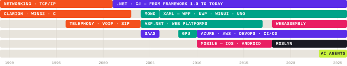

# Carl de Billy

Software architect in Montréal. I build the layer other people build on: platform internals,
compilers and tooling, and — lately — the runtime that lets an AI agent reason, use tools and run
code. .NET since Framework 1.0, and still here.

<picture>
  <source media="(prefers-color-scheme: dark)" srcset="assets/timeline-dark.svg">
  
</picture>

What I build with, by era. Lanes get reused — when one technology gives way to the next, it
takes the same row. The .NET lane never stops.

### The short version

`.NET` · `C#` · `XAML / WinUI` · `WebAssembly` · `Roslyn` · `MCP` · `LLM integration` ·
`AWS` · `Azure` · `Docker` · `Kubernetes` · `Proxmox` · `Ansible` · `TypeScript`

## What I work on

**[Uno Platform](https://github.com/unoplatform/uno)** — the open-source .NET platform for XAML
applications running on web, desktop and mobile. I architect the internals: layout engine, XAML Hot
Reload, the WebAssembly runtime, native integration for iOS, Android and Windows. Lately I lead the
architecture of the generative-AI work — an agent and its execution harness, and the Model Context
Protocol integration that lets AI tools inspect and drive a running application.

## Open source

**[Repl Toolkit](https://github.com/yllibed/repl)** — one .NET command graph that becomes a CLI, an
interactive REPL, remote sessions and a full MCP server. Define commands once in an ASP.NET Core
minimal-API style; every surface comes from the same handlers.
→ [repl.yllibed.org](https://repl.yllibed.org/)

**[Zigbee2MqttAssistant](https://github.com/yllibed/Zigbee2MqttAssistant)** — a GUI for Zigbee2Mqtt,
running in Docker and as a Home Assistant add-on. No longer actively maintained, and still being
pulled.

**[manictime-mcp](https://github.com/yllibed/manictime-mcp)** — an MCP server giving read-only access
to local ManicTime activity data. An independent integration, not affiliated with ManicTime.

**[Yllibed.HttpServer](https://github.com/carldebilly/Yllibed.HttpServer)** and
**[Yllibed.StreamMultiplexer](https://github.com/carldebilly/Yllibed.StreamMultiplexer)** — small,
focused .NET libraries: an embeddable HTTP server for mobile applications, and an implementation of
a stream-multiplexing protocol.

## Elsewhere

[Blog](http://carl.debilly.net/) ·
[Bluesky](https://bsky.app/profile/carl.debilly.net) ·
[Twitter](https://twitter.com/carldebilly) ·
[repl.yllibed.org](https://repl.yllibed.org/)
